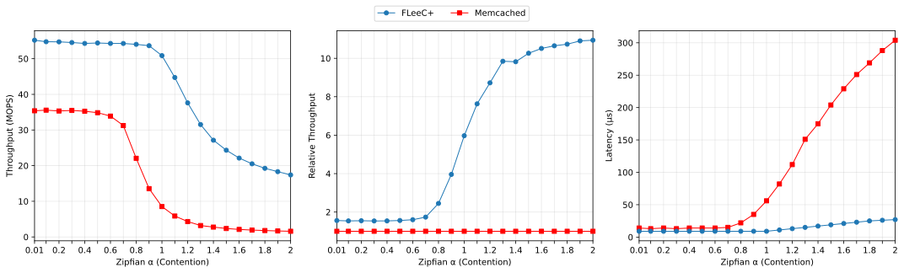

# FLeeC+: A Fully Lock-Free and Fast Application-Level Cache

**FLeeC+** is a fully lock-free, application-level cache system designed as the high-performance successor to **Memcached**. While modern web services rely heavily on in-memory caches to reduce latency, traditional systems like Memcached often suffer from scalability bottlenecks due to their reliance on blocking synchronization (locks). FLeeC+ addresses these limitations by replacing all core components with non-blocking data structures and algorithms, enabling efficient parallel access to shared data even under high contention.

FLeeC+ serves as a robust, drop-in replacement for Memcached, offering equivalent or superior performance across all operating conditions without notable drawbacks.

### Key Improvements Over Memcached

FLeeC+ introduces several architectural redesigns to maximize throughput and minimize latency:

*   **Cache-Friendly Indexing:** Instead of Memcached’s lock-striped hash table buckets implemented as linked lists, FLeeC+ features immutable, array-based buckets. This design optimizes CPU cache utilization and enables **completely synchronization-free read operations**, significantly accelerating lookups.
*   **Merged Indexing and Eviction:** FLeeC+ eliminates the separate, lock-protected segmented LRU queues used in Memcached. Instead, it merges the lookup and eviction structures into a single hash table with an embedded CLOCK policy. It uses a relaxed sampling approach to update access metadata, which eliminates the synchronization overhead inherent in strict LRU maintenance.
*   **Non-Blocking Hash Table Expansion:** While Memcached requires a "stop-the-world" phase to resize its hash table, FLeeC+ employs a non-blocking expansion mechanism that allows the system to continue servicing requests without interruption during resizing.
*   **Advanced Adaptive Memory Reclamation:** To ensure safe memory reuse in a lock-free environment, FLeeC+ utilizes an adaptive system that dynamically switches between **Epoch-Based Reclamation (EBR)** and **Hazard Pointers (HP)** depending on memory pressure, ensuring high efficiency when memory is plentiful, and precise reclamation under high memory pressure.

### Performance

Extensive evaluation across synthetic and real-world workloads with Twitter production traces demonstrate that FLeeC+ can provide more than **11x higher throughput** over Memcached as contention increases, while still maintaining approximately **1.6x higher performance** in low contention scenarios.

This figure demonstrates how each cache's throughput and latency vary with increasing levels of contention. The results show that FLeeC+ consistently outperforms Memcached, particularly under high contention scenarios, highlighting its superior scalability and efficiency.

